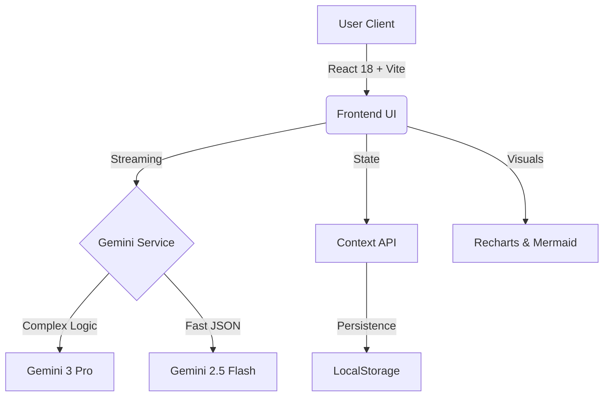

# 🧠 MentorAI

> **Winner** of the "Vibe Code with Gemini 3" Hackathon (Target Track)

<div align="center">
  


</div>

**MentorAI** is a production-grade, multimodal AI study assistant designed to help students master complex topics. Powered by **Google Gemini 3 Pro**, it features real-time reasoning transparency, document analysis (RAG), and agentic study tools in a beautiful Glassmorphism UI.

---

## 📑 Table of Contents
- [✨ Key Features](#-key-features)
- [🔥 Why This Project Stands Out](#-why-this-project-stands-out)
- [📸 Screenshots](#-screenshots)
- [🧩 Tech Stack](#-tech-stack)
- [🛠️ Setup & Installation](#️-setup--installation)
- [🚀 Usage](#-usage)
- [💡 Future Roadmap](#-future-roadmap)
- [📄 License](#-license)

---

## ✨ Key Features

### ⚡ Multimodal Chat with "Thinking" Visibility
Unlike standard chatbots, MentorAI exposes Gemini 3 Pro's reasoning process.
- **Deep Reasoning:** Click "View Reasoning" to see how the AI breaks down complex Math/Physics problems.
- **Visual Learning:** Upload diagrams or lecture slides for instant analysis.
- **Mermaid.js Integration:** Automatically converts explanations into visual flowcharts.

### 📚 Context-Aware RAG
- **Pin Documents:** Focus the AI's attention on specific files (PDFs, Notes).
- **Audio Analysis:** Upload a lecture recording (.mp3) and ask questions about it.

### 🛠️ Agentic Tools
- **Code Analyzer:** Paste code to get bug reports, Big-O analysis, and refactoring tips.
- **Flashcard Generator:** Generates 3D spaced-repetition cards in seconds (Gemini Flash).
- **Gamified Quiz Agent:** Adaptive quizzes with confetti celebrations and sound effects.

---

## 🔥 Why This Project Stands Out

Most hackathon projects are simple wrappers. **MentorAI** is a full ecosystem:

| Feature | Standard Chatbot | 🧠 MentorAI |
| :--- | :---: | :---: |
| **Reasoning** | Hidden / Black Box | **Transparent `<thinking>` Tags** |
| **Documents** | Simple Text Paste | **RAG with Pinning & Audio Support** |
| **Visuals** | Text Only | **Mermaid Diagrams & LaTeX Math** |
| **Speed** | Single Model | **Hybrid Route (Pro for Logic, Flash for Tools)** |

---

## 📸 Screenshots

### Main Chat Interface

<p align="center">
  
</p>
<p align="center"><em>Dark mode interface with multimodal chat capabilities</em></p>

<p align="center">
  
</p>
<p align="center"><em>Light mode for comfortable daytime studying</em></p>

### Key Features in Action
- **Reasoning Transparency:** View how AI thinks through problems
- **Document Upload:** Support for PDFs, images, and audio files
- **Quick Actions:** Pre-built prompts for common study tasks
- **Smooth Animations:** Framer Motion powered interactions

---

## 🧩 Tech Stack



**Frontend:** React 18, TypeScript, Tailwind CSS

**AI Core:** Google GenAI SDK (`@google/genai`)

**State Management:** React Context API + LocalStorage

**Visualization:** Framer Motion, Recharts, Mermaid.js

---

## 🛠️ Setup & Installation

### Prerequisites
- Node.js 18+ and npm/yarn
- A Google AI Studio API key ([Get one here](https://makersuite.google.com/app/apikey))

### 1. Clone the Repository

```bash
git clone https://github.com/nameershah/MentorAI.git
cd MentorAI
```

### 2. Install Dependencies

```bash
npm install
```

### 3. Set Environment Variables

Create a `.env` file in the root directory:

```env
VITE_GEMINI_API_KEY=your_api_key_here
```

### 4. Run Development Server

```bash
npm run dev
```

The app will be available at `http://localhost:5173`

### 5. Build for Production

```bash
npm run build
npm run preview
```

---

## 🚀 Usage

### Getting Started
1. **Start a New Session:** Click the "+" icon in the sidebar
2. **Upload Documents:** Use the folder icon to attach PDFs, images, or audio
3. **Ask Questions:** Type your query or use quick action buttons
4. **View Reasoning:** Click "View Reasoning" on any AI response to see the thinking process

### Tips for Best Results
- **Be Specific:** The more context you provide, the better the answers
- **Use Multimodal Input:** Combine text with images for visual problems
- **Pin Important Documents:** Use the pin feature to keep context across multiple questions
- **Try Different Tools:** Explore the Code Analyzer, Flashcard Generator, and Quiz Agent

---

## 💡 Future Roadmap

- [ ] Mobile app version (React Native)
- [ ] Collaborative study sessions
- [ ] Advanced analytics dashboard
- [ ] Integration with popular note-taking apps
- [ ] Offline mode with cached responses

---

## 📄 License

Distributed under the MIT License. See `LICENSE` for more information.

---

## 🙏 Acknowledgments

- Built with ❤️ for the Google AI Studio Hackathon
- Powered by Google Gemini 3 Pro
- UI inspired by modern glassmorphism design trends

---

<div align="center">
  <p><strong>Engineered by Muhammad Nameer Shah</strong></p>
  <p>
    <a href="https://github.com/nameershah">GitHub</a> •
    <a href="https://linkedin.com/in/nameershah">LinkedIn</a>
  </p>
</div>
