<br />

<div align="center">

# 🧠 MentorAI

**The Gemini 3 Powered Study Assistant**

> 🏆 **Winner** — Google AI Studio *Vibe Code with Gemini 3* Hackathon (Target Track)

<br />

<a href="https://ai.studio/apps/drive/1jX61pzQUuGnbiUBhk9DMI8kKxag1GrDz?fullscreenApplet=true" target="_blank">
  
</a>

<br />
<br />


</div>

<br />

**MentorAI** is not just another chatbot—it's a production-grade, multimodal AI study assistant that shows students *how* AI thinks. Built with **Google Gemini 3 Pro**, it exposes the reasoning process through transparent `<thinking>` tags, combines multimodal RAG with document pinning, and uses a hybrid architecture to deliver an unmatched learning experience.

**The Problem:** Traditional AI tutors give you answers. MentorAI shows you the *work*.

---

## 📑 Table of Contents
- [📸 Visual Tour](#-visual-tour)
- [✨ Key Features](#-key-features)
- [🎯 The "Wow" Factor](#-the-wow-factor)
- [🔥 Why This Stands Out](#-why-this-stands-out)
- [🏗️ Architecture](#️-architecture)
- [🛠️ Installation & Setup](#️-installation--setup)
- [💡 Usage Examples](#-usage-examples)
- [🏆 Hackathon Achievement](#-hackathon-achievement)
- [🚀 Roadmap](#-roadmap)

---

## 📸 Visual Tour

<table>
<tr>
<td width="50%">

### 🌙 Dark Mode Interface

*Glassmorphism UI with multimodal chat capabilities*

</td>
<td width="50%">

### ☀️ Light Mode Interface

*Clean, comfortable interface for daytime studying*

</td>
</tr>
</table>

### Key UI Features Visible:
- 💬 **Smart Sidebar** with Chat, Documents, Tools, Quiz Agent, and Settings
- 🎯 **Quick Action Buttons** for common study tasks
- 📁 **Document Upload** with image, audio, and file support
- 🎤 **Voice Input** for hands-free learning
- ✨ **Smooth Animations** powered by Framer Motion

---

## ✨ Key Features

### 🔍 **Transparent Reasoning Engine**
Unlike black-box chatbots, MentorAI exposes **Gemini 3 Pro's** internal monologue:
- Click **"View Reasoning"** to see how the AI breaks down complex problems step-by-step
- Watch the AI work through logic puzzles, math proofs, and coding challenges in real-time
- Learn by understanding the *process*, not just memorizing answers

**Example:** Ask *"If I have a 3L jug and a 5L jug, how do I measure exactly 4L?"* and watch the AI think through each pour.

### 📚 **Multimodal RAG with Context Pinning**
- **Pin Documents:** Upload PDFs or notes and focus the AI's attention on that content
- **Audio Analysis:** Upload lecture recordings (.mp3) and ask questions about specific topics discussed
- **Image Understanding:** Upload diagrams, graphs, or handwritten notes for instant analysis
- **Context Memory:** Pinned documents persist across conversations for deep study sessions

### 🛠️ **Agentic Study Tools**
- **Code Analyzer:** Paste code → get bug reports, Big-O complexity, and refactoring suggestions
- **Flashcard Generator:** Generates 3D spaced-repetition cards in **<2 seconds** using Gemini Flash
- **Gamified Quiz Agent:** Adaptive quizzes with confetti celebrations and real-time scoring
- **Visual Explanations:** Automatically renders Mermaid.js flowcharts and LaTeX math (e.g., $\int x^2 \sin(x) dx$)

---

## 🎯 The "Wow" Factor

### 1️⃣ **Hybrid Intelligence Architecture**
- **Gemini 3 Pro** for deep reasoning, code analysis, and multimodal understanding
- **Gemini 2.5 Flash** for lightning-fast tool generation (flashcards, quizzes, study plans)
- **Result:** Sub-second tool responses while maintaining reasoning depth

### 2️⃣ **Glassmorphism UI Design**
- Modern dark/light theme with `backdrop-blur` effects
- Smooth animations powered by Framer Motion
- Real-time streaming responses (token-by-token rendering)
- Optimistic UI updates for instant feedback

### 3️⃣ **True Multimodal Learning**
Students learn in multiple formats simultaneously:
- **Visual:** Mermaid diagrams, LaTeX equations, image analysis
- **Auditory:** Lecture audio transcription and Q&A
- **Kinesthetic:** Interactive quizzes with gamification
- **Reading/Writing:** Document analysis and note generation

---

## 🔥 Why This Stands Out

| Feature | Standard Chatbot | Traditional Tutors | 🧠 MentorAI |
| :--- | :---: | :---: | :---: |
| **Reasoning Transparency** | ❌ Hidden | ✅ Verbal | ✅ **Visual `<thinking>` Tags** |
| **Multimodal Input** | ⚠️ Text + Image | ❌ Text Only | ✅ **Text + Image + Audio + PDF** |
| **Context Memory** | ⚠️ Per-session | ✅ Human Memory | ✅ **Document Pinning + RAG** |
| **Speed** | ⚠️ Single Model | N/A | ✅ **Hybrid (Pro + Flash)** |
| **Visual Explanations** | ❌ Text Only | ⚠️ Whiteboard | ✅ **Auto Mermaid + LaTeX** |
| **Gamification** | ❌ None | ❌ None | ✅ **Confetti + Sound Effects** |
| **Cost** | 💰 API Costs | 💰💰 $40+/hr | 💚 **Free (Your API Key)** |

---

## 🏗️ Architecture

```mermaid
graph TB
    A[👤 Student] -->|Text/Image/Audio| B[React Frontend]
    B -->|Streaming| C{Router Logic}
    
    C -->|Complex Tasks| D[Gemini 3 Pro]
    C -->|Fast Tools| E[Gemini 2.5 Flash]
    
    D -->|Reasoning + Vision| F[Chat Response]
    E -->|JSON Output| G[Flashcards/Quizzes]
    
    B -->|State| H[Context API]
    H -->|Persistence| I[LocalStorage]
    
    B -->|RAG| J[Document Manager]
    J -->|Pinned Context| D
    
    B -->|Visuals| K[Mermaid.js]
    B -->|Math| L[LaTeX Renderer]
    
    style D fill:#8E75B2
    style E fill:#4285f4
    style B fill:#61DAFB
```



### Tech Stack Breakdown

**Frontend Core**
- **React 18** with TypeScript for type safety
- **Vite** for blazing-fast builds and HMR
- **Tailwind CSS** for utility-first styling with Glassmorphism effects

**AI Integration**
- **@google/genai** - Official Google GenAI SDK for Vibe Coding
- **Gemini 3 Pro Preview** - Complex reasoning, code analysis, vision
- **Gemini 2.5 Flash** - Fast JSON generation for tools

**State & Persistence**
- **React Context API** - Global state management
- **LocalStorage** - Session persistence and document caching

**Visualization & UX**
- **Framer Motion** - Smooth animations and transitions
- **Recharts** - Study analytics dashboard
- **Mermaid.js** - Automatic diagram generation from text
- **Lucide React** - Modern icon library
- **canvas-confetti** - Gamification effects

---

## 🛠️ Installation & Setup

### Prerequisites
- **Node.js 18+** and npm/yarn
- **Google AI Studio API Key** → [Get one here](https://makersuite.google.com/app/apikey)

### Quick Start

```bash
# 1. Clone the repository
git clone https://github.com/nameershah/MentorAI.git
cd MentorAI

# 2. Install dependencies
npm install

# 3. Configure environment
echo "VITE_GEMINI_API_KEY=your_api_key_here" > .env

# 4. Start development server
npm run dev

# App runs at http://localhost:5173
```

### Production Build

```bash
npm run build
npm run preview
```

---

## 💡 Usage Examples

### 🧮 Mathematics with LaTeX
**Prompt:** *"Solve this integral: $\int x^2 \sin(x) dx$"*

**Result:** 
- Renders beautiful LaTeX equations
- Shows step-by-step integration by parts
- Includes `<thinking>` tags showing the reasoning process

### 🖼️ Visual Learning
**Prompt:** *"Explain how a CPU works with a diagram"*

**Result:**
- Auto-generates a Mermaid.js flowchart
- Labels each component (ALU, Control Unit, Registers)
- Explains data flow in natural language

### 🧩 Logic Puzzles with Transparent Reasoning
**Prompt:** *"If I have a 3L jug and a 5L jug, how do I measure exactly 4L?"*

**Result:**
```
<thinking>
I need to find a sequence of pour operations...
Step 1: Fill the 5L jug completely
Step 2: Pour from 5L into 3L (now 5L has 2L remaining)
Step 3: Empty the 3L jug
Step 4: Pour the 2L from 5L into 3L
Step 5: Fill the 5L jug again
Step 6: Pour from 5L into 3L until 3L is full (uses 1L)
Result: 5L - 1L = 4L remaining in the 5L jug
</thinking>

Here's the solution: [Shows the full process]
```

### 📄 Document-Based Q&A (RAG)
1. Click the folder icon and upload a PDF lecture on Quantum Physics
2. **Prompt:** *"Create a quiz based on this document"*
3. **Result:** AI reads the PDF and generates 10 adaptive quiz questions in <3 seconds using Gemini Flash

### 🎧 Audio Lecture Analysis
1. Upload a recorded lecture (.mp3) using the microphone icon
2. **Prompt:** *"What did the professor say about neural networks?"*
3. **Result:** AI transcribes, understands, and answers based on the audio content

---

## 🏆 Hackathon Achievement

### Google AI Studio "Vibe Code with Gemini 3" Hackathon
- **Track:** Target Track (Building high-quality, specific applications)
- **Result:** 🥇 **Winner**
- **Recognition:** Awarded for exceptional use of Gemini 3 Pro's reasoning capabilities and production-ready UI/UX

**What Made It Stand Out:**
1. **Novel Use of `<thinking>` Tags** - First app to expose Gemini's reasoning to end users in a visual, interactive way
2. **Hybrid Model Strategy** - Intelligent routing between Pro and Flash for optimal performance and cost efficiency
3. **Production Polish** - Professional glassmorphism design with dark/light modes, not just a hackathon prototype
4. **Real Educational Value** - Solves actual student pain points with measurable learning outcomes

---

## 🚀 Roadmap

### 🎯 Coming Soon
- [ ] **Mobile Apps** - React Native versions for iOS and Android
- [ ] **Collaborative Study** - Real-time multiplayer study sessions with shared documents
- [ ] **Advanced Analytics** - ML-powered mastery prediction and weak area detection
- [ ] **Integration Hub** - Connect with Notion, Google Docs, Canvas LMS
- [ ] **Offline Mode** - Cached responses and local RAG for study on-the-go

### 💭 Future Ideas
- Voice-to-voice conversations with Gemini's multimodal capabilities
- AR flashcard scanning with phone camera
- Study group matching based on learning patterns
- Export study guides to Anki, Quizlet, and other spaced-repetition formats

---

## 📄 License

Distributed under the MIT License. See `LICENSE` for more information.

---

## 🙏 Acknowledgments

- **Google AI Studio** for hosting the hackathon and providing access to Gemini 3 Pro
- **Vibe Coding SDK** for making client-side AI integration seamless
- **Open Source Community** for the amazing libraries that power this application

---

<div align="center">
  <br />
  <p><strong>Engineered with ❤️ by Muhammad Nameer Shah</strong></p>
  <p>
    <a href="https://github.com/nameershah">
      
    </a>
    <a href="https://www.linkedin.com/in/muhammad-nameer-shah">
      
    </a>
  </p>
  <br />
  <p>
    <strong>Built for learners. Powered by Google Gemini 3 Pro.</strong>
  </p>
</div>
